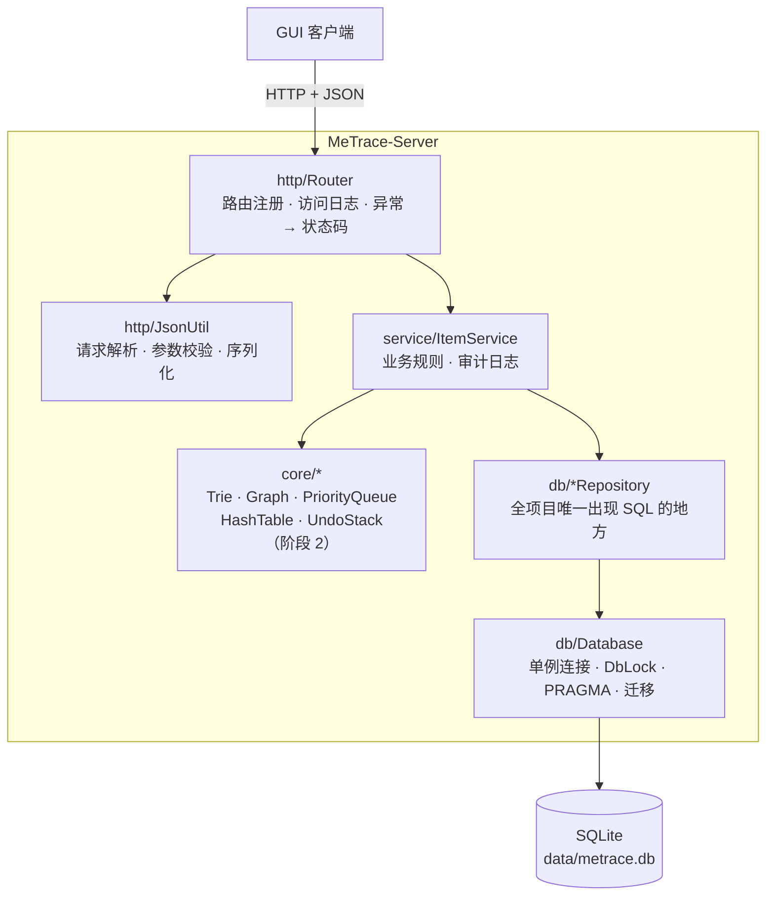

# MeTrace-Server

> 书影音迹 MeTrace —— 个人书影音追踪与智能推荐系统的服务端
>
> 《计算机科学与工程程序设计实践》课程设计项目。C/S 架构，服务端纯 C++ 实现，客户端 GUI 通过 HTTP + JSON 通信。

一个用来管理"书 / 影 / 音"收藏记录的 HTTP 服务：记录条目、打分、写短评、打标签，并在此之上提供前缀搜索、相似推荐、统计聚合与撤销/重做。数据持久化到 SQLite。

---

## 目录

- [特性](#特性)
- [技术栈](#技术栈)
- [快速开始](#快速开始)
- [配置](#配置)
- [API 文档](#api-文档)
- [数据库设计](#数据库设计)
- [架构与目录结构](#架构与目录结构)
- [开发进度](#开发进度)
- [常见问题](#常见问题)

---

## 特性

**已实现**

- 条目的增删改查，覆盖书 / 影 / 音三种类型
- 部分更新（PUT）：只传需要改的字段；可空字段传 `null` 表示清空
- 标签系统：打标签时自动创建不存在的标签，条目与标签多对多关联
- 组合过滤 + 排序 + 分页：按类型、状态、标签筛选，按评分 / 年份 / 创建时间 / 标题排序
- 完整的参数校验与语义化状态码（400 / 404 / 500）
- 审计日志：所有写操作落到 `action_log` 表，保留变更前后的快照
- 线程安全：httplib 线程池并发处理请求，数据库访问通过全局锁串行化
- 访问日志：记录方法、路径、状态码与耗时

**计划中**

- 基于 Trie 的前缀搜索（`/api/search`）
- 基于图的相似推荐（`/api/recommend`）
- 统计聚合（`/api/stats`）
- 撤销 / 重做（`/api/undo`、`/api/redo`）

---

## 技术栈

| 类别 | 选型 | 版本 |
|---|---|---|
| 语言 | C++17 | — |
| 构建 | CMake | ≥ 3.22.1 |
| HTTP | [cpp-httplib](https://github.com/yhirose/cpp-httplib) | v0.57.1 |
| JSON | [nlohmann/json](https://github.com/nlohmann/json) | v3.12.0 |
| 数据库 | [SQLiteCpp](https://github.com/SRombauts/SQLiteCpp)（内含 sqlite3 源码） | 3.4.0 |

三个依赖都由 CMake 的 `FetchContent` 直接拉取源码并锁定版本，**不需要系统预装**，也不需要 `third_party/` 目录。

---

## 快速开始

### 环境要求

- CMake ≥ 3.22.1
- 支持 C++17 的编译器（GCC ≥ 9 / Clang ≥ 10 / MSVC 2019+）
- 首次构建需要联网（拉取依赖）
- 运行测试需要 `curl`

### 构建

```bash
./scripts/build.sh
```

等价于：

```bash
cmake -S . -B build -DCMAKE_BUILD_TYPE=Release
cmake --build build -j$(nproc)
```

产物固定在 `build/bin/server`。

### 运行

```bash
./scripts/run.sh
# MeTrace-Server 已启动: http://127.0.0.1:8000  (db: ./data/metrace.db)
```

也可以直接带参数启动：

```bash
./build/bin/server --host 0.0.0.0 --port 9000 --db /tmp/demo.db
./build/bin/server --help
```

`--db` 指向的父目录不存在时会自动创建，所以默认的 `./data/` 不需要手工 `mkdir`。

### 试一试

```bash
# 健康检查
curl http://127.0.0.1:8000/ping

# 新增一个条目（标签"科幻"不存在会自动创建）
curl -X POST http://127.0.0.1:8000/api/items \
  -H 'Content-Type: application/json' \
  -d '{"type":"book","title":"三体","creator":"刘慈欣","year":2006,
       "status":"doing","progress":0.5,"score":9.5,"tags":["科幻","中国文学"]}'

# 查列表：只看在读的书，按评分倒序，第一页
curl 'http://127.0.0.1:8000/api/items?type=book&status=doing&sort=-score&limit=10'

# 改一条记录（只传要改的字段；score 传 null 表示清空评分）
curl -X PUT http://127.0.0.1:8000/api/items/1 \
  -H 'Content-Type: application/json' \
  -d '{"status":"done","progress":1,"score":9.8}'

# 删除
curl -i -X DELETE http://127.0.0.1:8000/api/items/1
```

### 接口测试

```bash
./scripts/run.sh --db /tmp/mediatrace-test.db &   # 测试会写数据，建议用临时库
./tests/test_api.sh http://127.0.0.1:8000
```

脚本会用 `curl` 跑 37 项断言，覆盖增删改查、分页过滤、参数校验与级联删除，最后打印通过 / 失败数量。

---

## 配置

优先级：**命令行参数 > 环境变量 > 默认值**。

| 命令行参数 | 环境变量 | 默认值 | 说明 |
|---|---|---|---|
| `--host <addr>` | `METRACE_HOST` | `127.0.0.1` | 监听地址 |
| `--port <port>` | `METRACE_PORT` | `8000` | 监听端口（1~65535） |
| `--db <path>` | `METRACE_DB` | `./data/metrace.db` | SQLite 数据库文件路径 |
| `--help` / `-h` | — | — | 打印用法 |

```bash
METRACE_PORT=9000 ./scripts/run.sh              # 用环境变量
./scripts/run.sh --port 9000                    # 用命令行（优先级更高）
```

数据库运行时会额外产生 `-wal` / `-shm` 两个文件（WAL 模式），已在 `.gitignore` 中忽略。

---

## API 文档

### 通用约定

- 基础 URL：`http://127.0.0.1:8000`
- 所有业务接口统一 `/api` 前缀；`/` 与 `/ping` 不加前缀
- 请求与响应均为 `application/json; charset=utf-8`
- ID 为 JSON 数字；时间格式 `YYYY-MM-DD HH:MM:SS`（**UTC**，SQLite 原生格式）
- 列表接口支持 `limit`（默认 20，上限 100）与 `offset`（默认 0）
- 可空字段未填时返回 `null`（例如未评分时 `score` 为 `null`），不要用 `0` 代替

> 响应中的 JSON 键按字母序排列（nlohmann/json 默认行为），本文档示例为便于阅读按业务字段顺序书写，键序不影响解析。

**错误响应**

```json
{ "error": "field 'title' is required and must be a non-empty string" }
```

HTTP 状态码本身即语义，body 中不再重复 `code` 字段：

| 状态码 | 含义 |
|---|---|
| 200 | 成功 |
| 201 | 创建成功（POST） |
| 204 | 删除成功（无 body） |
| 400 | 参数非法（缺必填、枚举取值错误、数值越界、JSON 格式错误） |
| 404 | 资源不存在，或路径未匹配任何路由 |
| 500 | 服务端异常 |

### 接口一览

| 方法 | 路径 | 说明 | 参数 / 请求体 | 响应 |
|---|---|---|---|---|
| GET | `/` | 纯文本存活探测 | — | `MeTrace-Server is running` |
| GET | `/ping` | 健康检查 | — | `{"status":"ok","service":"MeTrace-Server"}` |
| GET | `/api/items` | 条目列表 | `?type=&status=&tag=&sort=&limit=&offset=` | `{"total":N,"items":[Item,...]}` |
| POST | `/api/items` | 新增条目 | `Item`（`type`、`title` 必填） | `201` + `Item` |
| GET | `/api/items/{id}` | 单个条目 | — | `Item` |
| PUT | `/api/items/{id}` | 部分更新 | 任意 `Item` 字段，均可选 | `Item` |
| DELETE | `/api/items/{id}` | 删除条目 | — | `204`（无 body） |
| GET | `/api/tags` | 标签列表 | `?limit=&offset=` | `{"total":N,"items":[Tag,...]}` |
| POST | `/api/tags` | 新增标签 | `{"name":"科幻"}`，同名幂等 | `201` + `Tag` |

> 计划中：`/api/search`、`/api/recommend`、`/api/stats`、`/api/undo`、`/api/redo`（见 [开发进度](#开发进度)）。

### 查询参数

| 参数 | 取值 | 说明 |
|---|---|---|
| `type` | `book` / `movie` / `music` | 缺省不过滤 |
| `status` | `wish` / `doing` / `done` / `dropped` | 缺省不过滤 |
| `tag` | 标签名称 | 按名称精确匹配 |
| `sort` | `created_at` / `score` / `year` / `title`，前缀 `-` 表示倒序 | 默认 `-created_at` |
| `limit` | 1~100 | 默认 20，超出范围会被截断 |
| `offset` | ≥ 0 | 默认 0 |

取值非法（例如 `type=game`、`sort=unknown`）一律返回 400，而不是静默忽略。

### 数据模型

**Item**

| 字段 | 类型 | 说明 |
|---|---|---|
| `id` | number | 主键，服务端生成 |
| `type` | string | `book` / `movie` / `music` |
| `title` | string | 标题，必填，≤ 200 字符 |
| `creator` | string \| null | 作者 / 导演 / 艺术家 |
| `year` | number \| null | 年份，`0` 或未填视为未知（输出 `null`） |
| `cover_url` | string \| null | 封面图链接 |
| `description` | string \| null | 简介 |
| `status` | string | `wish` / `doing` / `done` / `dropped`，默认 `wish` |
| `progress` | number | 进度比例 `0`~`1`，默认 `0` |
| `score` | number \| null | 评分 `0`~`10`，未评分为 `null` |
| `review` | string \| null | 短评 |
| `tags` | string[] | 标签名数组，按名称排序，单个条目最多 20 个 |
| `created_at` | string | 创建时间（UTC） |
| `updated_at` | string | 更新时间（UTC），每次 PUT 自动刷新 |

**Tag**

| 字段 | 类型 | 说明 |
|---|---|---|
| `id` | number | 主键 |
| `name` | string | 标签名，全局唯一，≤ 50 字符 |

### 示例

**POST /api/items**

```json
// 请求
{
  "type": "book",
  "title": "三体",
  "creator": "刘慈欣",
  "year": 2006,
  "status": "doing",
  "progress": 0.5,
  "score": 9.5,
  "review": "震撼",
  "tags": ["科幻", "中国文学"]
}
```

```json
// 响应 201 Created
{
  "id": 1,
  "type": "book",
  "title": "三体",
  "creator": "刘慈欣",
  "year": 2006,
  "cover_url": null,
  "description": null,
  "status": "doing",
  "progress": 0.5,
  "score": 9.5,
  "review": "震撼",
  "tags": ["中国文学", "科幻"],
  "created_at": "2026-09-23 04:12:13",
  "updated_at": "2026-09-23 04:12:13"
}
```

说明：

- `tags` 中不存在的标签会被自动创建，并与条目插入放在**同一个事务**里；重复标签自动去重。
- 未提供的字段使用默认值（`status`→`wish`、`progress`→`0`、`score`→`null`）。
- 响应回传完整记录（含服务端生成的 `id` 与时间戳），便于客户端直接刷新本地缓存。

**PUT /api/items/{id}** 是部分更新，只有出现在请求体里的字段才会被写入：

```bash
curl -X PUT http://127.0.0.1:8000/api/items/1 \
  -H 'Content-Type: application/json' \
  -d '{"score": null}'
# 只把评分清空，其余字段不变
```

要整体替换标签就传数组，要清空标签就传 `null`：

```json
{ "tags": ["经典", "待重看"] }
```

哪些字段可以用 `null` 清空：

| 字段 | `null` 的语义 |
|---|---|
| `creator`、`cover_url`、`description`、`review` | 清空为 `null`（传空串 `""` 效果相同） |
| `score` | 清空评分，变为"未评分" |
| `year` | 重置为未知（输出 `null`） |
| `tags` | 清空所有标签关联 |
| `type`、`status`、`progress`、`title` | **不接受 `null`**，返回 400 —— 这些字段没有"空"的状态，静默改成默认值会篡改用户数据 |
| 任意字段"不出现" | 保持原值不变 |

**GET /api/items**

```json
{
  "total": 37,
  "items": [
    {
      "id": 1,
      "type": "book",
      "title": "三体",
      "creator": "刘慈欣",
      "status": "done",
      "progress": 1.0,
      "score": 9.8,
      "tags": ["中国文学", "科幻"],
      "created_at": "2026-09-23 04:12:13",
      "updated_at": "2026-09-23 04:12:53"
    }
  ]
}
```

`total` 是**满足过滤条件的总条数**（不受分页影响），用于客户端计算页数；`items` 只包含当前页。实现上是两条 SQL：一条 `COUNT(*)`，一条带 `LIMIT/OFFSET` 的查询。

---

## 数据库设计

SQLite，共四张表。建表与迁移在 `Database::migrate()` 中用代码完成，通过 `PRAGMA user_version` 记录 schema 版本，**不需要手工执行 SQL 文件**。

```sql
-- 条目表（书、影、音）
CREATE TABLE IF NOT EXISTS items (
    id          INTEGER PRIMARY KEY AUTOINCREMENT,
    type        TEXT NOT NULL CHECK(type IN ('book','movie','music')),
    title       TEXT NOT NULL,
    creator     TEXT,
    year        INTEGER,
    cover_url   TEXT,
    description TEXT,
    status      TEXT DEFAULT 'wish' CHECK(status IN ('wish','doing','done','dropped')),
    progress    REAL DEFAULT 0 CHECK(progress >= 0 AND progress <= 1),
    score       REAL CHECK(score IS NULL OR (score >= 0 AND score <= 10)),
    review      TEXT,
    created_at  DATETIME DEFAULT CURRENT_TIMESTAMP,
    updated_at  DATETIME DEFAULT CURRENT_TIMESTAMP
);

-- 标签表
CREATE TABLE IF NOT EXISTS tags (
    id   INTEGER PRIMARY KEY AUTOINCREMENT,
    name TEXT UNIQUE NOT NULL
);

-- 条目-标签关联表（多对多）
CREATE TABLE IF NOT EXISTS item_tags (
    item_id INTEGER NOT NULL,
    tag_id  INTEGER NOT NULL,
    PRIMARY KEY (item_id, tag_id),
    FOREIGN KEY (item_id) REFERENCES items(id) ON DELETE CASCADE,
    FOREIGN KEY (tag_id)  REFERENCES tags(id)  ON DELETE CASCADE
);

-- 操作日志（审计用，不参与撤销/重做）
CREATE TABLE IF NOT EXISTS action_log (
    id         INTEGER PRIMARY KEY AUTOINCREMENT,
    action     TEXT NOT NULL,        -- create_item / update_item / delete_item / create_tag ...
    payload    TEXT,                 -- JSON 格式的详情，update 会同时记录 before/after
    created_at DATETIME DEFAULT CURRENT_TIMESTAMP
);
```

几个容易踩坑的地方，已在实现中处理：

- **`updated_at` 不会自动更新**。SQLite 没有 `ON UPDATE`，`DEFAULT CURRENT_TIMESTAMP` 只在 INSERT 时生效，所以 `UPDATE` 语句里显式写了 `updated_at = CURRENT_TIMESTAMP`。
- **外键约束默认关闭**。连接建立后立即执行 `PRAGMA foreign_keys = ON;`，否则 `ON DELETE CASCADE` 不生效（删除条目后 `item_tags` 会残留脏数据）。
- **`score` 未评分存 `NULL` 而不是 `0`**，因为 `0` 表示"真的评了 0 分"。
- **迁移用事务包裹**，中途失败自动回滚，不会留下半张表。

同时开启的 PRAGMA：`journal_mode = WAL`（更好的读写并发与崩溃恢复）、`synchronous = NORMAL`、`temp_store = MEMORY`，连接忙等待 5000ms。

---

## 架构与目录结构



分层职责，**禁止跨层**：

| 层 | 目录 | 允许做的事 | 禁止做的事 |
|---|---|---|---|
| HTTP | `include/http/`、`src/http/` | 解析请求、调用 Service、写响应、统一异常映射 | 写 SQL、include SQLiteCpp、写业务规则 |
| Service | `include/service/`、`src/service/` | 校验业务规则、补默认值、编排仓储、写审计日志 | 写 SQL、include SQLiteCpp |
| DB | `include/db/`、`src/db/` | 预编译语句、参数绑定、事务、连接管理 | 关心 HTTP 状态码、解析 JSON 请求体 |

### 目录结构

```text
MeTrace-Server/
├── CMakeLists.txt
├── AGENT.md                     # 开发指南（架构约定与阶段计划）
├── README.md                    # 本文件
├── include/
│   ├── core/                    # 阶段 2：手写数据结构，待实现
│   ├── db/
│   │   ├── Database.h           # 连接管理（单例 + 全局锁 + 建表迁移）
│   │   ├── Models.h             # Item / Tag / ItemInput / ItemQuery 等纯数据结构
│   │   ├── ItemRepository.h     # items + item_tags + tags(upsert) 的所有 SQL
│   │   ├── TagRepository.h
│   │   └── ActionLogRepository.h
│   ├── service/
│   │   ├── ServiceError.h       # ValidationError / NotFoundError → 400 / 404
│   │   └── ItemService.h
│   └── http/
│       ├── Router.h
│       └── JsonUtil.h
├── src/                         # 与 include/ 一一对应的实现 + main.cpp
├── scripts/
│   ├── build.sh
│   └── run.sh
├── tests/
│   └── test_api.sh
├── data/                        # 运行时生成的 SQLite 文件（已 gitignore）
└── build/                       # 构建产物，含 FetchContent 缓存的依赖
```

### 线程安全

httplib 默认用线程池并发处理请求，而 `SQLite::Database` / `SQLite::Statement` **都不是线程安全的**，所以：

- `db/Database.h` 提供进程内单例连接 + `std::recursive_mutex`；
- 每个 Repository 方法第一行是 `DbLock lock;`，保证同一时刻只有一个线程访问连接；
- 需要用 `std::recursive_mutex` 而不是 `std::mutex`，否则 `handle()` 内部加锁与外部 `DbLock` 叠加会自锁死。

实测：`xargs -P 8` 并发 POST 50 条，全部返回 201，无 `SQLITE_BUSY`。

---

## 开发进度

### 阶段 1：项目搭建 ✅

- [x] CMake 配置与依赖引入（FetchContent）
- [x] 目录分层：`include/` + `src/`
- [x] `Database` 封装类（单例 + `DbLock` + PRAGMA + `user_version` 迁移）
- [x] Repository 层：`ItemRepository` / `TagRepository` / `ActionLogRepository`
- [x] Service 层：`ItemService`（校验 + 编排 + 审计日志）
- [x] HTTP 层：`Router` + `JsonUtil`
- [x] 命令行参数 `--host/--port/--db/--help`
- [x] 构建与运行脚本
- [x] 接口测试脚本（37 项断言全部通过）

### 阶段 2：核心数据结构（进行中）

- [ ] `Trie` —— 前缀树，用于标题 / 作者 / 标签的前缀搜索，查询 O(L)
- [ ] `Graph` —— 邻接表图，用于书影音关联与相似推荐，BFS/DFS O(V+E)
- [ ] `PriorityQueue` —— 二叉堆，用于评分排序与推荐 TopN，push/pop O(log n)
- [ ] `HashTable` —— 手写链地址法哈希表，用于条目内存缓存，平均 O(1)
- [ ] `UndoStack` —— 双栈，用于撤销/重做，操作 O(1)
- [ ] 每个数据结构的单元测试

### 阶段 3：业务逻辑与 API

- [ ] `SearchService` + `GET /api/search`
- [ ] `RecommendService` + `GET /api/recommend`
- [ ] `StatsService` + `GET /api/stats`
- [ ] `UndoService` + `POST /api/undo`、`POST /api/redo`

### 阶段 4：完善与验收准备

- [ ] 50~100 条演示数据
- [ ] 性能测试（1000 条数据下的搜索与推荐响应时间）
- [ ] 演示视频与讲稿

---

## 常见问题

**首次 `cmake` 卡在下载依赖？**

`FetchContent` 需要访问 GitHub 拉取三个依赖，缓存在 `build/_deps/`。网络不畅时可以配置代理，或提前在有网的环境构建一次后把 `build/` 目录一起带走。**演示前务必先跑通一次构建，之后不要删除 `build/`**，否则离线环境下无法重新配置。

**为什么 `build/bin/server` 而不是 `build/server`？**

`CMakeLists.txt` 里设置了 `CMAKE_RUNTIME_OUTPUT_DIRECTORY` 统一输出到 `build/bin/`。

**数据库文件在哪？**

默认 `./data/metrace.db`（相对于启动时的工作目录）。用 `--db` 可以指定其它位置。删除该文件即可清空所有数据，下次启动会自动重建表结构。

**为什么目录里还有 `.db-wal` 和 `.db-shm`？**

WAL 模式下 SQLite 会额外产生预写日志与共享内存文件，属于正常现象，已在 `.gitignore` 中忽略。程序正常退出后 `-wal` 会被合并回主库。

**`GET /api/items/abc` 为什么返回 404 而不是 400？**

路由用正则 `(\d+)` 匹配数字 ID，`abc` 不匹配任何路由，因此按"路由不存在"返回 404。这与"路径匹配上了但 ID 不合法"是两种情况。

**响应里 `progress` 为什么是 `1.0` 而不是 `1`？**

`progress` 是双精度浮点数，JSON 序列化会保留小数形式。两者数值相等，客户端按数值解析即可。

**中文标签的排序规则？**

标签按名称升序返回，比较的是 UTF-8 字节序，因此 `"中国文学"` 排在 `"科幻"` 前面。展示顺序由客户端决定即可。

---

## 相关文档

- [`AGENT.md`](AGENT.md) —— 开发指南：接口规格、数据库设计、分层约定、阶段计划与验收要点
